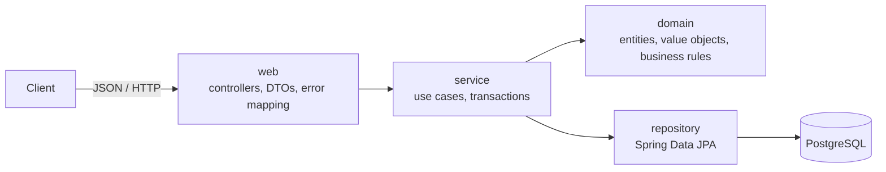

# Study Room Booking API

[](https://github.com/steeven7808-creator/studyroom-booking/actions/workflows/ci.yml)

A REST API for booking study rooms at UBC, built with Java 25, Spring Boot 4 and PostgreSQL. The focus is on enforcing business rules correctly under concurrency: two students can never hold the same room at the same time, even when their requests arrive simultaneously.

**Live demo:** [studyroom-booking.onrender.com/swagger-ui.html](https://studyroom-booking.onrender.com/swagger-ui.html). Try `POST /api/bookings` twice with the example body to watch the overlap rule reject the second request.

> Hosted on Render's free tier with a Neon serverless PostgreSQL database. The service sleeps when idle, so the first request after a while can take up to about 2 minutes.

## Business rules

1. A booking must fall within the room's opening hours, align to 30-minute boundaries, and last at most 2 hours.
2. A room cannot have two overlapping active bookings (cancelled bookings don't count).
3. A user can hold at most 3 hours of bookings per day.
4. Bookings follow a strict lifecycle: `CONFIRMED` → `CANCELLED` (only before it starts) or `COMPLETED` (only after it ends). Both are terminal.
5. A slot that has already started cannot be booked.

## Tech stack

Java 25 · Spring Boot 4.1 (Web MVC, Data JPA, Validation) · Hibernate 7 · PostgreSQL 18 · Flyway · JUnit · Mockito · Testcontainers · Docker Compose · GitHub Actions · springdoc-openapi (Swagger UI) · Docker · Render · Neon

## Architecture



Dependencies point one way. The domain layer knows nothing about HTTP or Spring, so every business rule can be unit-tested without starting the application or a database.

```
src/main/java/com/stevenzhang/studyroom_booking
├── domain       Room, User, Booking, TimeSlot, BookingStatus
├── repository   Spring Data JPA repositories and JPQL queries
├── service      BookingService (orchestration and transactions)
├── web          REST controller, request/response DTOs, exception handler
├── exception    framework-independent domain exceptions
└── config       injectable Clock
```

## Design decisions

**Rich domain model.** Rules that only concern a single booking live on the object itself. `Booking` can only be created through `Booking.create(...)`, which validates the slot, and it has no setters: state changes go through `cancel()` and `complete()`, which reject illegal transitions. An invalid `Booking` cannot exist in memory.

**`TimeSlot` as an immutable value object.** A Java `record` that validates `start < end` on construction and owns the interval logic (`duration`, `overlaps`, `isAlignedTo`). Intervals are half-open `[start, end)`, so back-to-back bookings such as 10:00–11:00 and 11:00–12:00 don't conflict.

**Two layers of overlap protection.** The service checks for conflicts before inserting, which gives fast, readable errors in the common case. But check-then-act is racy under concurrent requests, so the database enforces the invariant with a PostgreSQL exclusion constraint:

**Serializing each user's bookings for the daily limit.** Rule 3 is an aggregate over many rows, which no constraint can express. Instead, `createBooking` locks the user's row with `@Lock(PESSIMISTIC_WRITE)` (`SELECT ... FOR UPDATE`) before checking the limit, so concurrent requests from the same user run one at a time while different users never block each other. A test firing 6 simultaneous one-hour requests from one user confirms that exactly 3 succeed.

```sql
ALTER TABLE bookings
    ADD CONSTRAINT bookings_no_overlap
    EXCLUDE USING gist (room_id WITH =, tsrange(start_time, end_time) WITH &&)
    WHERE (status <> 'CANCELLED');
```

In a test that fires 8 simultaneous requests for the same slot, all 8 passed the application-level check in observed runs; the constraint rejected 7 and exactly one booking was created. The service translates the constraint violation into the same `422` response as a regular conflict.

**Deterministic time.** Domain methods take `now` as a parameter, and the service uses an injected `Clock` pinned to `America/Vancouver`. Tests use `Clock.fixed(...)`, so results never depend on when they run, and the "no past bookings" rule stays correct even on a server running in UTC.

**Schema owned by Flyway.** Versioned SQL migrations define the tables, `CHECK` constraints, indexes and the exclusion constraint. Hibernate runs with `ddl-auto=validate`, so the application refuses to start if entities and schema drift apart. Demo data lives in a separate location loaded only by the `dev` profile, so it never reaches tests or production.

**API contract via DTOs.** Entities are never serialized. Request DTOs control exactly which fields a client can set, and errors follow RFC 9457 problem details: `400` for malformed input (with per-field messages), `404` for unknown resources, `422` for business rule violations.

## Testing

44 tests, run on every push by GitHub Actions:

| Layer | Tests | Coverage |
|---|---|---|
| Domain unit tests | 27 | Slot validation, overlap edge cases, opening hours, status transitions |
| Service unit tests (Mockito) | 8 | Orchestration of rules 2 and 3, fail-fast checks, nothing saved on rejection |
| Integration tests (Testcontainers) | 9 | JPQL queries against real PostgreSQL, full context startup, concurrent booking |

```bash
./mvnw verify   # requires Docker for Testcontainers
```

## Running locally

Prerequisites: JDK 25 and Docker.

```bash
./mvnw spring-boot:run -Dspring-boot.run.profiles=dev
```

Spring Boot starts PostgreSQL through Docker Compose, Flyway applies the migrations, and the `dev` profile seeds three rooms and two users. Interactive API documentation is available at http://localhost:8080/swagger-ui.html once the app is running.

## Deployment

The app ships as a multi-stage Docker image (JDK build stage, JRE-only runtime). The `demo` profile reads all database settings from environment variables, trusts the platform proxy's forwarded headers so generated URLs use HTTPS, and lets idle connections close so the serverless database can scale to zero. Render redeploys automatically from `main`.

## API

| Method | Path | Description |
|---|---|---|
| `POST` | `/api/bookings` | Create a booking |
| `GET` | `/api/bookings/{id}` | Get a booking |
| `POST` | `/api/bookings/{id}/cancel` | Cancel a booking |

Example (use any future date):

```bash
curl -i -X POST http://localhost:8080/api/bookings \
  -H 'Content-Type: application/json' \
  -d '{"roomId":1,"userId":1,"startTime":"2026-10-01T10:00:00","endTime":"2026-10-01T11:00:00"}'
```

```json
{"id":1,"roomId":1,"userId":1,"startTime":"2026-10-01T10:00:00","endTime":"2026-10-01T11:00:00","status":"CONFIRMED"}
```

Requesting an overlapping slot returns:

```json
{"title":"Unprocessable Content","status":422,"detail":"The room is already booked for this time","instance":"/api/bookings"}
```

## Known limitations and next steps

- **No authentication.** Any caller can act on behalf of any user. Planned: Spring Security with JWT, plus ownership checks on cancellation.
- **Single time zone by design.** Times are stored as `TIMESTAMP` in campus time. Supporting multiple campuses would mean moving to `TIMESTAMPTZ` and `Instant`.
- **Rooms and users** are currently seeded rather than managed through the API.